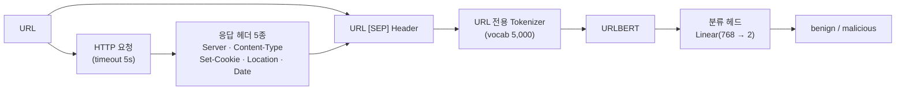

# 🤖 URL-BERT Phishing Detection

> URL 데이터로 사전학습된 **URLBERT**를 **피싱 URL 분류**에 맞게 파인튜닝하고, HTTP 응답 헤더를 함께 학습시켜 탐지 성능을 높인 프로젝트

<p>
  
  
  
  
  
</p>

이 모델은 큐싱(QR 피싱) 탐지 서비스 **[SQanaR](https://github.com/dlwl224/final_sqanar)** 의 핵심 탐지 엔진으로 사용되었습니다.

---

## 📋 목차
1. [왜 URLBERT인가](#-왜-urlbert인가)
2. [핵심 아이디어 — URL + HTTP Header](#-핵심-아이디어--url--http-header)
3. [데이터셋](#-데이터셋)
4. [모델 구조와 학습](#-모델-구조와-학습)
5. [학습 결과](#-학습-결과)
6. [추론과 설명 (XAI)](#-추론과-설명-xai)
7. [프로젝트 구조](#-프로젝트-구조)
8. [실행 방법](#-실행-방법)
9. [출처](#-출처)

---

## 💡 왜 URLBERT인가

| 모델 | 한계 |
| :--- | :--- |
| XGBoost (수작업 특징) | 사람이 정한 특징에 의존 → 새로운 유형의 피싱 URL에 약함 |
| BERT (일반) | 자연어 문장으로 학습 → `도메인 · 경로 · 파라미터` 같은 URL 구조를 잘 이해하지 못함 |
| **URLBERT** | **대규모 URL 데이터로 사전학습**된 BERT + URL 전용 토크나이저 → URL 구조 자체를 이해 |

블랙리스트에 없는 **제로데이 피싱 URL**도 구조만 보고 판별하기 위해 URLBERT를 선택했습니다.

---

## 🔑 핵심 아이디어 — URL + HTTP Header

URL 문자열은 공격자가 정상 사이트처럼 위장하기 쉽습니다. 그래서 URL에 직접 접속해 받은 **HTTP 응답 헤더**를 함께 입력했습니다.



- `Location`(리다이렉트 목적지), `Set-Cookie`, `Server` 같은 값은 URL 문자열보다 위장하기 어렵습니다.
- 접속이 안 되면 `NOHEADER`로 표시해, 헤더가 없는 경우도 하나의 신호로 학습시켰습니다.

---

## 📦 데이터셋

| 구분 | 정상(benign) | 피싱(malicious) | 합계 |
| :--- | --: | --: | --: |
| Train | 40,000 | 39,998 | 79,998 |
| Test | 10,000 | 10,000 | 20,000 |
| **합계** | | | **약 10만 건** |

- 정상·피싱 비율을 1:1로 맞춰 한쪽으로 치우친 학습을 방지
- 각 URL에 대해 응답 헤더를 수집해 `URL [SEP] Header` 형태로 가공 ([`dataset/header.py`](urlbert2/dataset/header.py))
- 정상 URL 보강을 위해 국내 사이트 링크를 크롤링해 추가 ([`dataset/naver.py`](urlbert2/dataset/naver.py))

---

## 🧠 모델 구조와 학습

```python
class BertForSequenceClassification(nn.Module):
    def __init__(self, bert):
        super().__init__()
        self.bert = bert                      # 사전학습된 URLBERT
        self.dropout = nn.Dropout(p=0.1)
        self.classifier = nn.Linear(768, 2)   # benign / malicious

    def forward(self, x):
        context, types, mask = x
        out = self.bert(context, attention_mask=mask, token_type_ids=types,
                        output_hidden_states=True)
        cls = out.hidden_states[-1][:, 0, :]  # [CLS] 토큰 벡터
        return self.classifier(self.dropout(cls))
```

| 항목 | 값 |
| :--- | :--- |
| 입력 길이 | 512 토큰 (URL + Header) |
| Optimizer | AdamW (lr 2e-5, weight decay 1e-4) |
| Batch size | 64 |
| Epoch | 5 (검증 정확도가 가장 높은 가중치 저장) |
| 학습 방식 | URLBERT 전체 파라미터 파인튜닝 |

---

## 📈 학습 결과

URL + Header 입력, 학습 데이터의 80%로 학습하고 20%로 검증했습니다 ([`finetune/phishing/phishing2.ipynb`](urlbert2/finetune/phishing/phishing2.ipynb)).

| Epoch | Accuracy | Precision | Recall | F1 |
| :-: | :-: | :-: | :-: | :-: |
| 1 | 98.82% | 97.95% | 99.73% | 98.83% |
| 2 | 99.21% | 99.08% | 99.35% | 99.22% |
| 3 | 99.35% | 99.13% | 99.56% | 99.35% |
| 4 | 99.48% | 99.48% | 99.48% | 99.48% |
| 5 | 99.51% | 99.39% | 99.64% | 99.52% |
| **최종 (best 가중치)** | **99.64%** | **99.59%** | **99.69%** | **99.64%** |

**모델 비교**

| 모델 | Accuracy |
| :--- | :-: |
| XGBoost | 95.99% |
| BERT (일반) | 94.03% |
| **URLBERT + Header** | **99.64%** |

> 보안 탐지에서는 **Recall(피싱을 놓치지 않는 비율)** 이 특히 중요합니다. 최종 모델은 Recall 99.69%로, 피싱 URL 1,000개 중 약 997개를 잡아냅니다.

---

## 🔍 추론과 설명 (XAI)

서비스에서 바로 쓸 수 있도록 추론 모듈을 따로 만들었습니다 ([`core/`](urlbert2/core)).

- [`model_loader.py`](urlbert2/core/model_loader.py) — 서버 시작 시 모델·토크나이저를 한 번만 불러와 재사용
- [`urlbert_analyzer.py`](urlbert2/core/urlbert_analyzer.py) — 헤더 수집 → 전처리 → 판별 → 신뢰도 반환
- **LIME**으로 판정에 영향을 준 토큰을 찾아, 사용자가 이해할 수 있는 문장으로 설명
- 잘 알려진 도메인 목록을 두어 설명 문구의 오해를 줄임

```python
from core.model_loader import load_inference_model
from core.urlbert_analyzer import classify_url_and_explain

model, tokenizer = load_inference_model()
result = classify_url_and_explain("https://example.com", model, tokenizer)
# → { "url": ..., "is_malicious": 0 or 1, "confidence": ..., "header_info": ..., 설명 ... }
```

---

## 📁 프로젝트 구조

```
urlbert2/
├── bert_config/            # URLBERT 설정
├── bert_tokenizer/         # URL 전용 vocab
├── bert_model/             # 사전학습 가중치 (용량 문제로 별도 다운로드)
├── dataset/                # 데이터 수집 · 헤더 수집 · 병합 · 비율 확인 스크립트, 학습/테스트 CSV
├── finetune/phishing/      # 파인튜닝 노트북 · 스크립트
├── core/                   # 서비스용 추론 · 설명 모듈
├── config.py               # 경로 · 하이퍼파라미터 · 헤더 목록
└── app.py                  # 추론 테스트 실행 파일
```

---

## ⚙️ 실행 방법

```bash
cd urlbert2
pip install torch transformers pytorch-pretrained-bert pandas numpy scikit-learn requests lime
```

1. 사전학습 가중치를 [`bert_model/README.md`](urlbert2/bert_model/README.md)의 링크에서 받아 `bert_model/`에 저장
2. 파인튜닝된 분류 가중치를 `finetune/phishing/checkpoints/`에 저장 (`config.py`의 `CLASSIFIER_MODEL_PATH`)
3. 추론 테스트
   ```bash
   python app.py
   ```

---

## 📚 출처

- 사전학습 모델과 기본 코드는 **URLBERT** 논문의 공개 구현을 기반으로 합니다.
  *Li et al., "URLBERT: A Contrastive and Adversarial Pre-trained Model for URL Classification", 2024*
- 원본 코드는 Apache License 2.0을 따릅니다 ([`LICENSE.txt`](urlbert2/LICENSE.txt)).

**직접 수행한 부분**: 피싱 데이터셋 구축 · HTTP 헤더 수집 및 `URL [SEP] Header` 입력 설계 · 분류 헤드 파인튜닝 · 모델 비교 실험 · 서비스용 추론/설명 모듈(`core/`)
